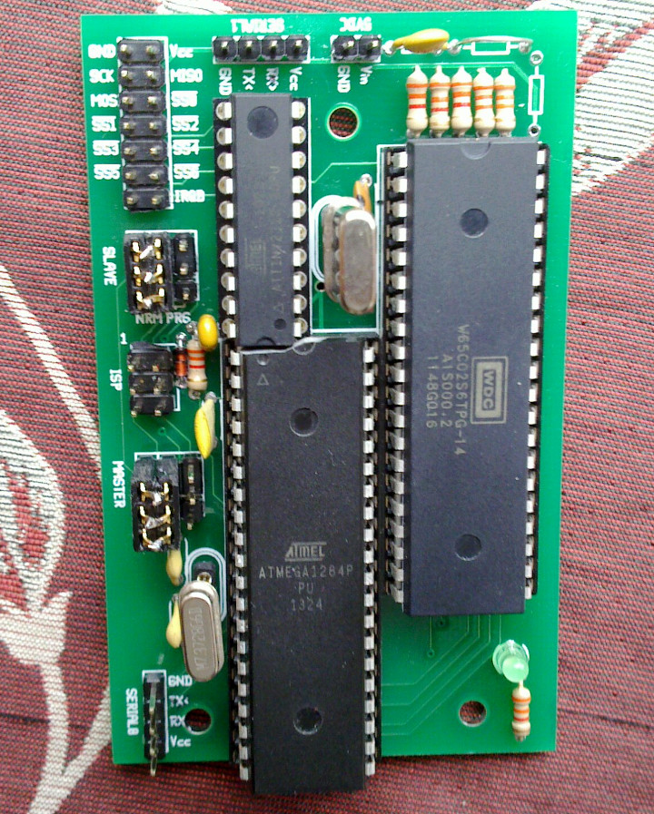

R1 is a system with a real 6502 but with everything else simulated by two AVRs.  The only reason for the second ( slave) AVR is because the ATmega1284P ran out of pins.

  - The header in the top-left corner is the SPI bus
  - The UART header at the top is the simulated UART available to the 6502
  - The UART header in the  bottom-left corner is the Admin UART for control of the system
  - The improvised jumper blocks wire the AVRs to the SPI bus in the left-hand position or allow ISP in the right-hand position

  - [gEDA gschem schematic](R1.sch)
  - [gEDA PCB layout](R1.pcb)

## Features

  - `PHI2` is under software control of the master AVR, which:
    - Means that only a fully static 6502 is supported
    - Severely limits the performance of the 6502
    - Results in a irregular `PHI2` as some bus devices take longer to be accessed.  Rather than use wait states, `PHI2` is simply not advanced until the bus operation is complete
    - Allow the whole system to be frozen, resumed and single-stepped under user control

  - Hardware UART ( provided by the slave AVR) capable of 115,200 baud

  - Hardware SPI ( provided by the master AVR) capable of 10 MHz, up to 7 slaves

  - IRQB on the SPI bus

  - All 16 address lines are sampled by the master AVR allowing the full 64K of address space to be simulated

  - The master AVR has an "Admin" UART that can be used by a PC to control the system.  Bus devices could be simulated ( slowly) on a PC over this link

  - Simulated bus devices:
    - 15K RAM.  The master AVR has 16K but needs some for itself
    - ROM.  Can be served from AVR RAM for rapid ROM development or from AVR program memory ( 120+K of it)
    - EEPROM ( 4K of it in the ATmega128)
    - UART.  This is actually the UART on the slave AVR, accessed transparently via SPI
    - SPI.  The master drives the SPI bus, simulating a 65SPI-like bus device.  The slave AVR is commanded by the master ( also via SPI) to control the Slave Select lines
    - Timers in the slave AVRs
    - Potentially others:
      - Timers in the master AVR ( although since the master AVR doesn't drive `IRQB` it would have to ask the slave to interrupt the 6502)
      - Hardware multiplier
      - Blitter

By changing the firmware, it would be possible to simulate ( very slowly) 64K of RAM by simulating the RAM on a PC and having it served over the serial port.  The UART becomes the transport layer for the 6502 bus.  Slow but flexible.

## Problems

The first boards had problems requiring rework:

  - There wasn't enough space between the master and slave AVRs.  Some of the package of the master AVR had to be ground off
  - `AVCC` was left unconnected instead of being wired to `Vcc`.  The UART didn't work
  - There was no pull-up for `IRQB`.  An internal pull-up in the slave AVR would be inelegant because it would require more code to disable the pull-up when asserting `IRQB`
  - There was no pull-up for `MISO`.  When no slave is selected, the digital input buffers on all devices connected to `MISO` will flap, which causes no problems but increases power consumption

### SPI

The SPI bus is used for two purposes:

  1.  For the Master AVR to interact with the Slave AVR
  1.  For the 6502 to interact with off-board SPI devices

If the Master were to select the Slave and conduct an SPI exchange while an off-board SPI device were selected by the 6502 then all hell would break loose ( the slave selected by the 6502 would receive a spurious byte intended for the Slave AVR, but worse: both selected SPI slaves would try to drive `MISO`).

Thankfully this can be mitigated:

  1.  The Slave AVR is in control of all off-board Slave Select lines.  It can therefore release any selected off-board slave as soon as it is selected by the master and before the master sends any data
  1.  The Master AVR provides the simulated bus device that the 6502 uses to select off-board SPI devices so the Master can keep track of whether an off-board slave is selected or not.  The Master can then avoid interacting with the Slave AVR while an off-board SPI device is selected

Currently the Master interacts with the Slave AVR in these scenarios:

  1.  To reset the 6502.  In this case it's OK that any SPI transaction that the 6502 was conducting is interrupted by releasing the off-board SPI device
  1.  To select an off-board SPI device because the 6502 asked it to.  Fine because the 6502 is in control
  1.  To interact with the UART on the Slave AVR, which is available as a simulated bus device to the 6502.  This means that the 6502 should *not* interact with the UART simulated on the 6502 bus while an off-board SPI device is selected, which is possible because the 6502 is the only device that selects off-board SPI devices and should be able to keep track of whether one is selected or not.  This could be fixed by making the Master cleverer so that bytes sent to or configuration changes of the UART are buffered and the Master would lie that no UART data has been received while an off-board SPI device is selected ( Fine because the Slave AVR has a RX buffer)
  1.  If the Master were extended so that it could assert `IRQB` ( via the Slave AVR).  Again this could be buffered until the off-board SPI device is released by the 6502
  1.  When the 6502 interacts with the timers simulated on the Slave AVR.  The 6502 will have to avoid interacting with the simulated timers while an off-board device is selected

