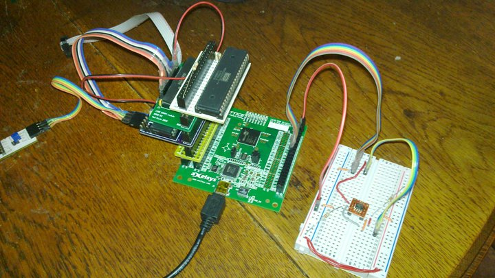

R2 is a system with a real 6502 and 128K SRAM but with everything else provided by an FPGA.

Currently it lives as modules based around a 2x20 headers that stack Arduino-style.

There are modules for:

  - The 6502
  - A 128K SRAM, although 512K is available in the same footprint so that would have been a better choice
  - A "Monitor" AVR that can be instructed via RS-232 to suspend the 6502, read and write to the SRAM and reset the 6502
  - An adapter from the Lattice HX8K development board headers to the bus

The FPGA provides:

  - Address decoding
  - Reset control
  - A clock scaler to provide PHI2
  - Cycle counter
  - UART
  - SPI

## Reset control

`RESB` on the FPGA is open collector.  Following a strobe low on `RESB` the FPGA will pull `RESB` low for at least two cycles of `PHI2` even if `PHI2` is stopped.

## Clock scaler

The clock scaler is accessible to the 6502 as a memory-mapped bus device.  Currently the maximum speed is 6 MHz, at which the system is stable so it's more for later revisions when the FPGA will be clocked faster.

## Cycle counter

The cycle counter is a bus device available to the 6502 that makes it easier to count the cycles used by some code.  A write to register `0` resets the counter and begins counting cycles of `PHI2`.  A read stops the counting so that the value may be read.

## UART

The UART only seems stable at 9600 baud.  Received frames seem to be corrupted at higher rates although it was initially stable at 115200 baud.  An external serial-friendly oscillator might help.

## SPI

The SPI master only supports mode 0 but seems to be able to read and write an SPI flash reliably so far.

