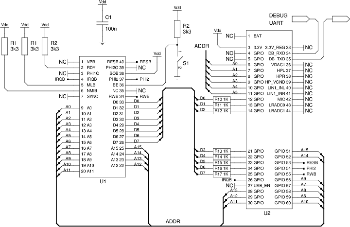

# Free run

A Free Run is a very simple application of a 6502, where the data bus is always driven with the value `$ea`, which is the opcode for the `NOP` ( No Operation) instruction

  - From the perspective of the microprocessor, it is wired to a 64K ROM filled with `NOP`
  - As the microprocessor executes each `NOP`, it advances through memory so the address on the address bus changes
  - Watching the address bus lines changing shows that the microprocessor is working

In this example, an ARM SoC:

  - Provides the system clock on `PHI2`.  Note that earlier versions of the 6502 cannot be clocked this slowly
  - Manages the Reset (`RESB`) cycle: low for 2 cycles then a further 7 cycles of nonsense on the address lines
  - Keeps the `IRQB` line high because IRQs are not part of this experiment
  - Displays the state of the address lines as a 16-bit address in memory

On a breadboard:

The program on the SoC that drives the controls lines:

Video, 15 MB: [First free run](first-free-run.mp4)

